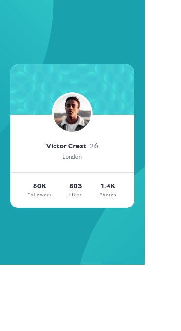
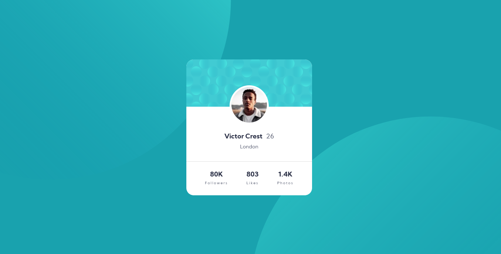

# Frontend Mentor - Profile card component solution

This is a solution to the [Profile card component challenge on Frontend Mentor](https://www.frontendmentor.io/challenges/profile-card-component-cfArpWshJ).

## Table of contents

- [Overview](#overview)
  - [The challenge](#the-challenge)
  - [Screenshot](#screenshot)
  - [Links](#links)
- [My process](#my-process)
  - [Built with](#built-with)
  - [What I learned](#what-i-learned)

## Overview

### The challenge

- Build out the project to the designs provided
- Make sure that layout looks good depending on device's screen size (moblie: 375px, desktop: 1366px)

### Screenshot

### Links

- [Frontend Mentor](https://www.frontendmentor.io)
- [Challenge](https://www.frontendmentor.io/challenges/profile-card-component-cfArpWshJ).

## My process

### Built with

- Semantic HTML5 markup
- CSS custom properties
- Flexbox
- Pseudoelements
- Mobile-first approach

### What I learned

Position background svg elements without them shifting when device's screen is changing.
